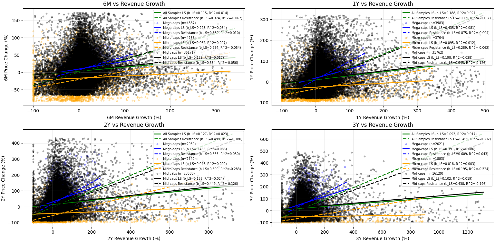
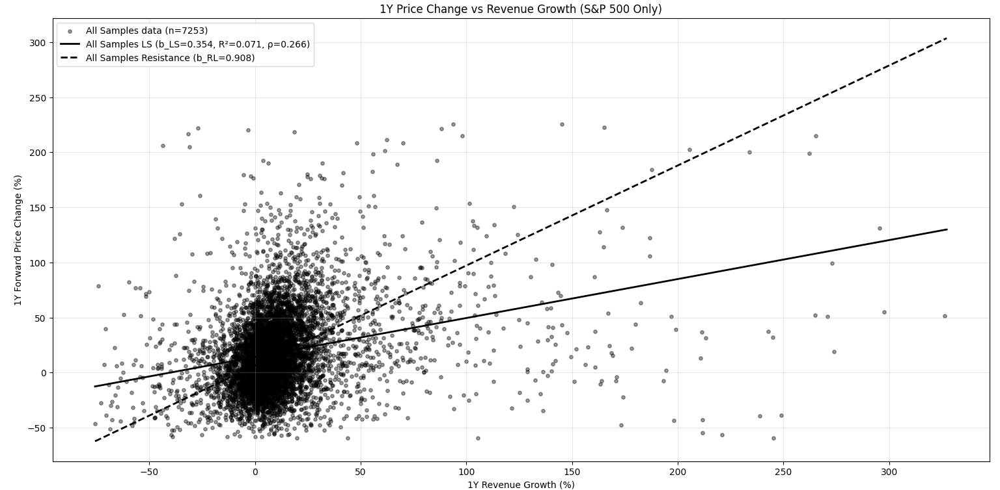
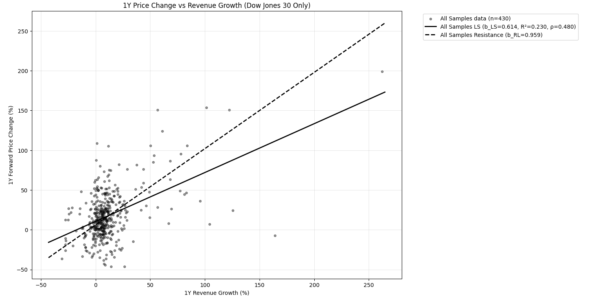
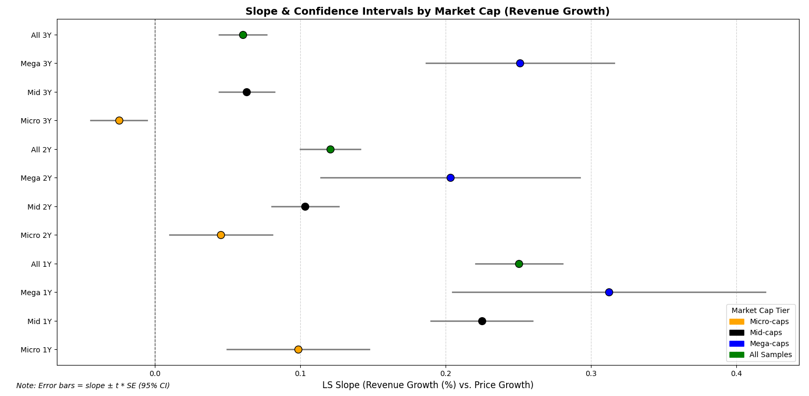

# Statistical Stock Market Test

This repository investigates whether **revenue growth can predict future stock price movements** for U.S. public companies.  
Using quarterly data from over 5,000 firms (2020–2024), we apply regression analysis and statistical tests across different market capitalizations and indices.

Our main finding: **revenue growth is a statistically significant predictor of future returns**, especially for large-cap and index-listed firms, though explanatory power remains modest.

---

## Key Results

### Revenue Growth vs. Price Changes Across Horizons
Revenue growth shows consistent positive predictive power, with stronger relationships in mega-cap firms and longer horizons.

### Index-Level Analysis (1Y Horizon)

Large, mature indices display stronger revenue–price links.

- **S&P 500**  

- **NASDAQ-100**  

- **Dow Jones 30**  

### Confidence Intervals
95% confidence intervals confirm robustness of slopes, especially for large-cap firms at 1–2 year horizons.

## Resources

- 📄 `written/stats_paper.pdf`
- Processed dataset: [open-stock-reports-dataset](https://huggingface.co/datasets/almogtavor/open-stock-reports-dataset)
- Includes quarterly financials + stock prices for 5,000+ U.S. public companies (2020–2025).
